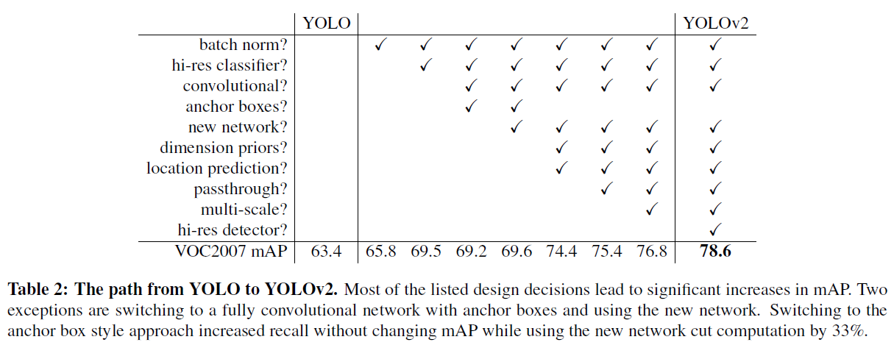

### このページは[こちら](https://kentapt.hatenablog.com/entry/matlabAdventDay21)の記事の原稿になります。もしよろしければ、この記事もご覧ください。

# YOLOv2について

この記事は、MATLABアドベントカレンダー（その2）の1x日目の記事として書かれています。

[https://qiita.com/advent-calendar/2022/matlab](https://qiita.com/advent-calendar/2022/matlab)

  

この記事では、物体検出の有名な手法である、YOLOv2について説明を行います。物体検出の手法を用いて、以下のように画像中から対象を自動的に検出することができます。


YOLOにより物体を検出しているときの動画の例も挙げます。以下の動画をご覧ください。


YOLOモデルは物体検出において非常に有名で、様々なバージョンが公開されています。この中でも、ネットワークがシンプルで、比較的高速かつ高精度に物体検出ができる、YOLOv2についてまとめたいと思います。YOLOなどの物体検出ネットワークの仕組みを説明した記事は多く存在します。本記事では、もとの論文の和訳をして、作者による説明を把握しつつ、適宜、補足説明を行います。これにより、論文をベースにした情報に触れながらも、（まずはぼんやりと）内容の理解の進む記事になればよいなと思いました。

　そこで、本記事では、以下のリンクにある Redmon and  Farhadi (2017) の論文の、Introductionと、Betterのセクションの和訳を行い、さらに、適宜、筆者の理解による補足を行います。特にBetterセクションでは、図を追加して、YOLOv2の原理について説明を行います。これにより、元の論文の流れをベースとして、YOLOv2の概要をつかみやすくすることを目指します。本記事を通して、物体検出の方法の理解度が上がれば嬉しく思います。なお、本論文では、以下の論文から図を引用しております。

**[論文情報]**

Redmon, J., \& Farhadi, A. (2017). YOLO9000: better, faster, stronger. In *Proceedings of the IEEE conference on computer vision and pattern recognition* (pp. 7263-7271).

**[論文のURL]**

[https://arxiv.org/abs/1612.08242](https://arxiv.org/abs/1612.08242)

# 論文の和訳

それでは、さっそく論文のIntroductionから和訳を行っていきます。また、和訳に関しては、筆者の勝手な理解に基づいた意訳を多く含みます。ご注意ください。（）内の内容は筆者による補足説明です。

## Introduction

物体検出は、高速かつ正確で、さまざまな物体を認識できる必要がある。ニューラルネットワークの利用が広まり、物体検出のネットワークは、高速かつ高精度になってきている。しかし、ほとんどの物体検出手法は、まだ少数のオブジェクトに限定されており、現在の物体検出のデータセットは、分類やタグ付けといった他のタスクのデータセットに比べ、（データ数が）限られている。最も一般的な物体検出用データセットは、数千から数十万の画像のタグが含まれている[3] [10] [2]。一方で、分類データセットには、数百万の画像と数万から数十万のカテゴリが含まれる[20] [2] 。（このように、物体検出用のデータセットの量が少ないことがわかる。）

　本論文では、検出を物体分類のレベルにまで拡張することを考える。しかし、物体検出のためのラベリングは、分類やタグ付けのためのラベリングよりもはるかに時間とコストがかかる。そのため、分類と同規模の物体検出用データセットが近い将来に登場する可能性は低い。我々は、既に存在する大量の分類データ を利用し、現在の検出システムの適用範囲を拡大する新しい手法を提案する。本手法は、異なるデータセットを一緒に組み合わせるために、物体の分類ラベルに対して階層的な見かたをする（例：食べもの⇒お肉系⇒焼肉）。また、物体検出と画像分類の両方のデータセットを用いて、物体検出のためのネットワークを学習することが可能なアルゴリズムも提案する。本手法は、（分類用の）ラベル付けをされたデータセットを利用して物体の正確な位置情報の推定方法を学習する。それに加え、分類のためのデータセットを利用して分類できる画像の種類を増やしたり、頑健性を向上させる。 この方法を用いて、9000以上の異なる物体のカテゴリを検出でき、さらにリアルタイムで推論のできるネットワーク（YOLO9000とよぶ）を学習させる。まず、ベースとなるYOLOとよばれるネットワークを改良し、YOLOv2の開発を行った。次に、ImageNetの9000クラス以上の画像分類のデータや物体検出のデータを用いてモデルの学習を行う。

## Better

YOLOは、その他の物体検出手法と比較して、様々な欠点を抱えている。YOLOとFast R-CNNを比較した場合、YOLOはより多くの位置推定の誤差を有することがわかった（物体を検出したとしても、その位置に誤差が含まれる）。さらに、YOLOはregion proposal-basedな手法と比較して、再現率が低い（検出漏れが多い）ことがわかった。したがって、YOLOv2では分類精度を維持しつつ、主に再現率と位置推定の精度を向上させることを目指す。（以降、再現率をrecallとする）

　近年は深層学習を用いた物体検出の精度を向上させるために、ネットワークをより大きく、より深くする傾向にある[6] [18] [17]。より良い性能を得るためには、複数のモデルを構築し、それらの結果の平均などを取ることもある（アンサンブル）。 しかし、アンサンブルは計算コストも多くなるため、YOLOv2では、より正確かつ高速なネットワークを実現する。ネットワークのサイズを大きくする代わりに、ネットワークを単純化する。今回の提案では、過去の研究から得たアイデアと独自のコンセプトを融合させた。それらの結果の要約を表2に示す（この表の見方としては、チェックがあるところが、YOLOと比べて新たに追加した技術だと思います。例えば、左から2つ目の列だと、Batch Normalizationを追加した時はmAPが65.8で、そうでない場合は63.4である、といった形です）。

  



### Batch Normalization

バッチ正規化により、他の正則化手法を使うことなく、学習を大幅に収束させやすくなる[7]。YOLOに含まれる全てのの畳み込み層の後にバッチ正規化層を加えることで、mAPが2%以上改善された。また、バッチ正規化はネットワークの正則化に役立つ。バッチ正規化により、ネットワークの過学習を防ぎ、ネットワークからドロップアウト層を除去することもできる。

バッチ正規化については、以下の記事がわかりやすかったです。

https://cvml-expertguide.net/terms/dl/layers/batch-normalization-layer/

### High Resolution Classifier

最先端の検出手法は、すべてImageNet [16]で事前に学習させた分類器を用いている。AlexNetを始めとして、ほとんどの分類器は、入力の画像のサイズが、256×256より小さいことが必要である [8]。オリジナルのYOLOでは，224×224の入力サイズで分類器ネットワークを学習し、検出のために画像サイズがを448×448になるように調整している。つまり、物体検出においては、画像分類から物体検出という異なるタスクのために、新たに学習が必要になるだけでなく、新しい入力解像度に適応する必要がある。そこで、YOLOv2では、まずImageNet上で10エポックの間、448×448の画像サイズで分類器ネットワークを微調整する。これにより、ネットワークはより画像サイズの大きい場合にも学習できるように各種重みなどをを調整するしやすくなる。この操作により、4%近いmAPの増加が得られた。

### Convolutional With Anchor Boxes (その1)

YOLOは、畳み込み層の後に全結合層を置き、バウンディングボックスの座標を直接予測する。一方、Faster R-CNNでは座標を直接予測するのではなく、手動で選んだ事前分布を使用してバウンディングボックスを予測する[15]。そして、領域提案ネットワーク（RPN）を用いて、そのボックスのオフセットと信頼度を予測する。全結合層を用いて、直接バウンディングボックスの座標を予測するものとは異なり、畳み込み層の各グリッドが各ボックスのオフセットや信頼度を計算している。

  

==========論文の和訳をひとやすみ==========

### 補足事項1: YOLOv2のおおまかな流れについて

ちょうど上の、Convolutional With Anchor Boxesという章の前半で、YOLOv2の処理の内容が少し記述されていました。

そこで、論文の和訳は中断し、ここで、YOLOv2の大まかな流れを以下の図をもとに説明します。そして、このおおまかな流れの説明の後で、論文に戻り、どのような経緯でこのような方法に行きついたかを見ていきたいと思います。


1) 各画像をS×Sの領域に分割する (a)

   -  上図の例では、(a)の画像が、4×4に分割されています 
   -  実際は入力の画像をこのように直接的に分割するのではなくて畳み込み層を通して、結果的に入力が小さくなります。その畳み込み層などの結果も、RGBの3チャンネルではなくて、およそ数千ものチャンネル数があります。 

2) 1)で作成した各グリッドに物体があった場合、それはどのクラスか（クラス確率）を計算する (b)

   -  (b)を見てください。各グリッドがカラフルに色付けされています。例えば、黄色が樹木、緑が植生、青が車、赤が地表面付近の物体だとします。このように各グリッドのクラスを計算します。厳密には、各クラスの数値を計算して、その中で最も確率の高いクラスをそのグリッドのクラスとします。 
   -  ここでは、物体があった場合の、条件付確率を求めています。つまり、物体があったと仮定したら、それぞれのクラスの確率はいくらであるかということです。 
   -  「そのグリッドに物体がある」とは、その物体の中心がそのグリッドに存在する場合を指します。 

（引用：YOLOの論文）

If the center of an object falls into a grid cell, that grid cell is responsible for detecting that object.

3) 各グリッドにおいて、物体がありそうなバウンディングボックスの位置とその信頼度を計算 

   -  (c)を見てください。検出するための箱（バウンディングボックス）が複数出力されていることがわかります 
   -  ここで、(バウンディングボックスの情報) = (中心のx, y座標＋横幅、縦幅）で表すことができます。なぜなら、それぞれのバウンディングボックスの中心（や左上の隅）の座標を基準として、さらに横幅と縦幅がわかれば、バウンディングボックスは一つに定まるからです。 
   -  前方の樹木の幹や後方の樹木、自動車を検出したいのですが、(c)では、それらと関係のないものも複数出ており、この時点では正確な検出ができていないことがわかります。 
   -  推論時は、信頼度スコアqのみを予想。損失を計算して、重みを更新していく際は、右辺の値をもとに誤差が求まる。物体がない場合は0で、ある場合はIoUの値と等価 


   \item{  }

4) . (b), (c)より、信頼度×クラス確率を計算（[d]）

⇒各クラスごとの信頼度スコア（どれだけ推論が正確そうか）がわかる

（4’. 上の信頼度スコアやボックスの大きさが閾値以下なら消去）

5) 複数のバウンディングボックスが出力されないようにNMS を実行

**NMSについて補足**

1.Scoreの高いボックスから選択

2.そのボックスとIoUの高いもの (e.g. 0.5）を消去⇒繰り返し


  

==========論文の和訳を再開==========

上の章で、YOLOv2の大まかな流れを紹介しました。これにより、だいたいの雰囲気がつかめました。そこで、論文の和訳を再開し、このような手法い至った経緯を確認したいと思います。

**Convolutional With Anchor Boxes (その2)**

YOLOでは、全連結層を用いて、直接バウンディングボックスの位置を推定するのではなく、アンカーボックスを使って、各グリッドに存在する、バウンディングボックスの位置を予測する。ここではまず、プーリング層を1層削除し、ネットワークの畳み込み層の出力の解像度を高める（≒特徴マップの縦と横の大きさを大きくする）

　またYOLOに入力する画像のサイズを小さくする。従来の448×448ピクセルから416×416ピクセルに縮小した。この理由は、畳み込みなどの結果で得られる特徴マップの縦横のピクセル数を奇数にしたいためである。提案するYOLOの畳み込み層により、入力画像を32分の1にダウンサンプリングする。つまり、416×416ピクセルの入力画像をYOLOにより処理すると、13×13の出力特徴マップが得られる。

　アンカーボックスを用いた物体検出においては、各物体のクラスの予測と、各物体の位置の予測は別々に行われる。アンカーボックスごとにクラスとそのセルの物体らしさをYOLOでは予測したが、本手法もそれと同様のプロセスを踏む。物体らしさの予測の方法として、YOLOと同様に、グランドトゥルースとバウンディングボックスのIoUを予測する。また、その物体のクラスの予測においては、「そのバウンディングボックス内に物体が存在する場合における、その物体のクラスの確率」という、条件付き確率を予測する。

　しかし、アンカーボックスを用いると、精度が少し低下してしまうという課題も存在する。YOLOは1画像あたり98個のボックスを予測するが、今回のようなYOLOv2にてアンカーボックスを用いた検出を行うことで、バウンディングボックスは1000個以上生成されるする。本発表の過程で試作した、アンカーボックスを用いない場合のモデルでは、mAPが、69.5 mAP、recallは81%であった。一方、今回のようなアンカーボックスを用いた場合、mAPは69.2 mAP、recallは88%であり、mAPは若干低下していることがわかる。しかし、recallの値は高く、mAPが減少しているとはいえ、本モデルにも改良の余地があると言える。

**Dimension of Clusters**

　YOLOでアンカーボックスを使用する場合、2つの課題が生ずる。1つ目は、バウンディングボックスの寸法を手動にて選択する必要があるということだ（バウンディングボックスの寸法は自動では決められないということだ）。先述したように、ネットワークはバウンディングボックスの大きさ（の差分）を出力すること（や学習すること）が可能ではあるが、事前により確からしいバウンディングボックスのサイズを入力できれば、より精度の良い検出ができると考えられる。

　完全に手動で（勘や経験に近い形で）事前分布を選択するのではなく、学習セットにてラベリング情報にあるバウンディングボックスの寸法に対してk-meansクラスタリングを実行することを考える。これにより、よりよいバウンディングボックスの大きさの設定が可能となる。標準的な、ユークリッド距離を用いたk-means法を使用した場合、大きなバウンディングボックスは小さなバウンディングボックスよりも、より大きな誤差を生ずる（単に寸法が大きいため、例えば同じ10%の誤差でも絶対量としては大きくなる）。ここでの目標は、より高いIoUを得るためのバウンディングボックスの大きさを決定することである。そこで、k-meansにて用いる「距離」の定義として、以下のものを用いる。


以下の図2に示すように、様々なクラスタ数（kの値）を用いて、k-meansを実行した。そして各クラスタにて、

1 最もそのクラスタの中心に近いバウンディングボックスの寸法を求める

2 そのクラスタの全てのバウンディングボックスと1で特定したバウンディングボックスのIoUを求める

3 全てのバウンディングボックスに対する、そのIoUの値を平均する

4 そのkの値のIoUの平均（3の値）をプロットする

ということを行う。

本論文では、k = 5にてClusterの数とIoUの値のバランスがとれていると判断し、クラスタの数は5とした。その結果、図2の右側のパネル中にあるように、様々な種類のバウンディングボックスを得ることができた。


==========論文の和訳を終了==========

YOLOv2の論文の一部しか和訳ができていませんが、これまでの内容で、おおよその仕組みや流れが紹介できたと思います。最後に、テストデータにて推論を行い、検出を行ったときに、その検出の良しあしを評価する方法について述べます。

**物体検出の評価方法について補足**

物体検出の評価指標として、平均適合率（mean Average Precision: mAP）が有名です。

具体的な計算方法については、以下の記事で紹介しています。

https://kentapt.hatenablog.com/entry/2022/01/31/090906

# アンカーボックスボックスの寸法を求めてみよう

後半は、YOLOv2の学習を行う上で、必要なステップについて、コードとともに確認していきたいと思います。

和訳の最後の部分で、アンカーボックスの寸法を、kmeans法により求めるとありました。論文中の図を見るだけでは、少し難しかったので、ここで例を用いて確認をしたいと思います。

なお、2022年12月現在では、`estimateAnchorBoxes`関数で、1行でアンカーボックスの計算を行うことができます。

https://jp.mathworks.com/help/vision/ref/estimateanchorboxes.html?s_tid=doc_ta

## データセットのダウンロード

この例では、295 枚の車両の画像から構成されるデータセットを使用します。Caltech の Cars 1999 データ セットおよび Cars 2001 データ セットからのものです (Caltech Computational Vision の [Web サイト](http://www.vision.caltech.edu/archive.html)で入手可能)であり、Pietro Perona 氏によって作成されました。

以下のコードにて、ダウンロードすることができます。

```matlab:Code
clear;clc;close all
pretrainedURL = 'https://www.mathworks.com/supportfiles/vision/data/yolov2ResNet50VehicleExample_19b.mat';
websave('yolov2ResNet50VehicleExample_19b.mat',pretrainedURL);
unzip vehicleDatasetImages.zip
data = load('vehicleDatasetGroundTruth.mat');
vehicleDataset = data.vehicleDataset;
```

## バウンディングボックスの分布を可視化

アンカーボックスの寸法を求めるときに、学習データのバウンディングボックスの情報を用います。本データの様子を眺めるため、面積とアスペクト比を用いてプロットします。

```matlab:Code
% バウンディングボックスの情報を抽出
allBoxes = cell2mat(vehicleDataset.vehicle);
% バウンディングボックスの面積とアスペクト比のプロット
% アスペクト比の計算
aspectRatio = allBoxes(:,3) ./ allBoxes(:,4);
% 面積の計算
area = prod(allBoxes(:,3:4),2);
% 図示
figure
scatter(area,aspectRatio)
xlabel("バウンディングボックスの面積")
ylabel("アスペクト比 (width/height)");
title("面積 vs. アスペクト比")
```


## バウンディングボックスをクラスタリングし、アンカーボックスを決定

例えば、クラスタの数を6に設定し、論文と似た方法で、バウンディングボックスの寸法を決定したいと思います。

論文では、kmeans法が紹介されていました。しかし、ここでは、kmedoidsを用います。kmedoids関数では、デフォルトの設定として、kmeans++法を実行します。

まずは、例として、クラスタの数を6としてみます。また、距離は論文にあったとおり、ユークリッド距離ではなく、IoUに関する値（1-IoU）でした。距離の定義をカスタムに設定するため、`'Distance'`の引数を設定します。また、具体的な距離の計算の仕方は、`iouDistanceMetric.m`というコードに記述します。

```matlab:Code
% 6つのグループにクラスタリング
numAnchors = 6;

% K-Medoidsを使ってクラスタリング
[clusterAssignments, anchorBoxes, sumd] = kmedoids(allBoxes(:,3:4),numAnchors,'Distance',@iouDistanceMetric);

% クラスタリングした平均アンカーボックスのサイズ
disp(anchorBoxes);
```

```text:Output
   145   105
    38    31
    96    64
   192   148
   115    82
    50    40
```

```matlab:Code
% クラスタリング結果のプロット
figure
gscatter(area,aspectRatio,clusterAssignments);
title("K-Mediodsで"+numAnchors+"個クラスタリング")
xlabel("面積")
ylabel("アスペクト比 (width/height)");
grid
```


```matlab:Code
% 累積加算
counts = accumarray(clusterAssignments, ones(length(clusterAssignments),1),[],@(x)sum(x)-1);

% 平均IoUを計算
meanIoU = mean(1 - sumd./(counts));
disp("平均IoU : " + meanIoU);
```

```text:Output
平均IoU : 0.86311
```

このように、kmedoids法とバウンディングボックス情報から、クラスタ数が6のときの平均IoUを求めることができました。最後に、論文にあったように、kの値を変えながら、平均IoUとアンカーボックスの数のバランスを可視化しようと思います。

## アンカーボックスの数と平均IoUの関係の確認

上のセクションのコードをfor文で回します。

アンカーボックスを増やすと平均IoUは改善するが計算量は増大します。

このデータセットでは以下のような関係を得ることができました。論文での記述と合わせると、だいたいk=5くらいが良いのではないかと思われます。

```matlab:Code
% 1から15までアンカーボックスを増やしたときに平均IoUの改善がどうなるかを計算する
maxNumAnchors = 15;
for k = 1:maxNumAnchors
    fprintf('number of anchor box: %d\n',k)
    % Estimate anchors using clustering.
    [clusterAssignments, ~, sumd] = kmedoids(allBoxes(:,3:4),k,'Distance',@iouDistanceMetric);
    
    % 平均IoUを計算
    counts = accumarray(clusterAssignments, ones(length(clusterAssignments),1),[],@(x)sum(x)-1);
    meanIoU(k) = mean(1 - sumd./(counts));
end
```

```text:Output
number of anchor box: 1
number of anchor box: 2
number of anchor box: 3
number of anchor box: 4
number of anchor box: 5
number of anchor box: 6
number of anchor box: 7
number of anchor box: 8
number of anchor box: 9
number of anchor box: 10
number of anchor box: 11
number of anchor box: 12
number of anchor box: 13
number of anchor box: 14
number of anchor box: 15
```

```matlab:Code
figure
plot(1:maxNumAnchors, meanIoU,'-o')
ylabel("平均IoU")
xlabel("アンカー数")
title("アンカー数 vs. 平均IoU")
```


# まとめ

この記事では、YOLOv2の仕組みを論文の和訳とともに紹介しました。また、後半では、アンカーボックスの寸法の決定方法を、小規模なデータセットを用いて確認しました。
